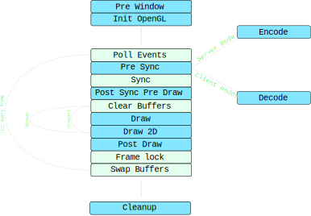

# How it works
## Rendering
The central component in SGCT is a singleton class called the `Engine`.  Its instance handles all initialization, rendering, network communication, and configuration handling.  The application needs to bind callback functions to the engine to customize specific tasks, for example initialization, rendering, and input handling.  To start SGCT's render loop, the function `Engine::render()` has to be called and it will only return once the application is ready to be terminated.  The registered callbacks are called in different stages in the rendering process illustrated below:

Blue boxes represent callback functions that can be set by the application.  None of the callbacks are necessary for the operation of SGCT.  Following is a description of the callbacks and what they can be used for in the generic case.

### Pre-Window
This callback is called by SGCT once before the windows for the node are created and thus before any OpenGL context is created, which means that no OpenGL calls should be made in this callback.  However, the configuration has already been read at this point and the network connecting the server and clients has been initialized.

### Init OpenGL
This callback is executed once after all windows for the node have been created and everything related to OpenGL in SGCT has been initialized.  SGCT creates an OpenGL context for each window and an additional shared OpenGL context.  The callback function received a pointer to the shared OpenGL context which can be used by the application to either initialize OpenGL objects or create additional contexts.

This callback is usually used by applications to load textures, compile shaders, and do other initial setup before the render loop starts.

### Poll Events
In the beginning of the render loop, the input devices are polled from the operating system and the registered callbacks are executed.  All of these callbacks are based on the GLFW input system, documentation of which can be found [here](https://www.glfw.org/docs/3.0/group__input.html).

#### Mouse Button
This callback is called whenever the stage of a mouse button changes.  The arguments to this function are the button that changed, any keyboard modifier that was pressed at the time (`Shift`, `Control`, `Alt`, or `Super`), and the action that caused the callback.

#### Mouse Position
This callback is called whenever the position of the mouse changes.  The arguments to the callback are the x and y position in screen coordinates.

#### Mouse Scroll
This callback is executed when the mosition of the mouse's scroll wheel changes.  The parameters to this function are the scroll offset along the x and y axes.

#### Keyboard
This callback is called whenever the state of a key on the keyboard changes.  The parameters are the key that was changed, any modifiers on the keyboard (`Shift`, `Control`, `Alt`, or `Super`) that were pressed at the same time, the action that triggered the callback (Press, Release, or Repeat), and the system-specific scancode of the key.

#### Character
This callback is called whenever a character was entered using the keyboard.  The argument to this callback is the unicode code point of the character.  The difference between this and the `Keyboard` callback is that the `Keyboard` responds to physical keys on the keyboard, whereas this callback is based on Unicode codepoints generated by the keys.  In general, a physical key press can create any number of Unicode characters.

#### Drop
This callback is executed when the user drops one or more files onto one of the active windows of the application.  The parameters are the number of files that were dropped and a list of paths to the individual files.

### Pre Synchronization (PreSync)
This callback is called before the synchronization stage during which data is synchronized from the server to the client nodes in the cluster.  Shared variables (see [Classes](classes.md)) that are set in this callback by the server will be synchronized to the clients and can be read there.

### Sync
This stage distributes the shared data from the server to the clients.  The clients wait for the data to be received before the rendering takes place.  Two callbacks have to be set for this stage to work;  the **server** has to set the `encode()` function callback and the **clients** have to set the `decode()` callback.  At runtime, SGCT determines which of the callbacks will be called, so there is no problem in setting the `decode()` for the master and vice versa.  These wrong callbacks will be ignored.  The data set by the application in the `encode()` callback will be serialized by the server, transferred to the clients via network, deserialized, and its contents are then available in the `decode()` callback.  The `shareddata.h` file contains two helper functions `serializeObject` and `deserializeObject` that can be used by the application to serialize its data.

As the data is transferred as is, it is important to make sure that the data serialized is [POD](https://en.cppreference.com/w/cpp/named_req/PODType), or the behavior might be surprising when decoding the data.  Additionally, be aware of serializing any data structure that contains pointers to other parts in memory.  Just serializing the pointer value itself is most definitely not what you would want to do as that pointer will be invalid on the client machines.  In those cases, it is better to use your own way of referring to objects, for example through the use of identifiers.

#### Encode
This callback is only executed on the server and the application is responsible to fill the buffer provided by the `SharedData` singleton.  All variables that are provided to that class will then be available in the client's `Decode` callback.

#### Decode
This callback will be called only on the clients at which time they can read the buffer provided by the `SharedData` singleton.  Please note that the variables have to be accessed in the same order in which the `Encode` callback has added them to the buffer.

### Post Synchronization Pre Draw (PostSyncPreDraw)
At this stage, the synchronized variables are available and can be used to perform application-specific tasks.  These might include, for example, synchronizing random number generator seeds, applying the physics computation performed on the server, react to user input, etc.

### Draw
This callback is executed by SGCT multiple times per frame and the application has to render its content in this step.  The number of times this callback is executed depends on the configuration that was used to start the application.  For example: for each monoscopic, flat viewport, the `draw()` callback is called once, for each stereoscopic, flat viewport the `draw()` callback is called twice, once for the left eye, once for the right eye.  For a 180 degree fisheye, the draw callback is called four times, once for each environment map cube face that is used to construct the fisheye.

In order to render correctly, the application **has** to use the `RenderData` struct that is passed as an argument to the callback.  The struct contains information about the active window, the viewport, and frustum mode that the callback is called for.  Most importantly, however, the struct also contains the `modelViewProjectionMatrix` that should be used by the application to render its scene.  For the normal OpenGL pipeline, the application should treat this matrix as the projection matrix component and it should continue handling its own model and view matrices, depending on the use case.

### Draw 2D
This callback is executed after all `Draw` callbacks have been executed.  This callback can be used by the application to rendering 2D elements, for example user interfaces.  While there is no strict reason to split the `Draw` and `Draw2D` callbacks, the SGCT configuration files allow users to toggle the `Draw` and `Draw2D` for individual windows.  This makes it easier to, for example, setup a scenario in which a user creates two windows, one window for controlling an application that omits the expensive 3D rendering, and a second window that only contains the 3D rendering but omits the user interface.

### Post Draw
This stage is called after the rendering is finished and before SGCT waits for frame lock or V-Sync, if these are enabled.  The application can use this callback to trigger computations that can make use of excess CPU cycles that otherwise would be wasted while waiting for V-Sync, if the rendering is finished faster than the target frame rate.

### Frame lock
In the case of a clustered environment with more than one node that are **not** connected via Nvidia's swap barriers, this stage of the render loop will synchronize the server and clients via light-weight network packages such that the rendering on all nodes has finished before continuing.  If there is only a single node or all nodes are in a swap group, this stage is effectively a null operation.

### Swap Buffers
At this point the front and back buffers (or both front and back buffers in the case of active stereo) are swapped.  Either because of swap groups or because of the frame locking stage before, these swaps will happen on all machines simulteneously(*-ish* in the second case) to prevent tearing.

### Cleanup
This callback is called exactly once after the render loop of SGCT has been terminated by either closing all windows or calling the `Engine::terminate` function. The shared OpenGL context is still avaiable in this callback and should be used by the application to cleanup any remaining objects.
